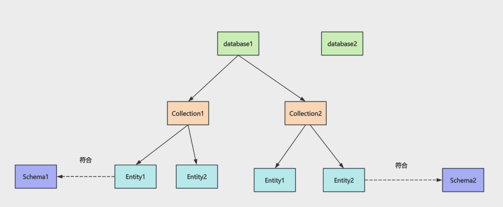

# 工具

tool-learn文件夹

## 大模型调用工具

### 流程

初始化基本模型、定义工具、定义对话消息数组

模型绑定工具

使用初始对话消息数组与模型对话，得到首次回答

处理首次回答，看回答中是否有tool_call调用工具字段返回，若有则依次处理每个工具调用，然后将首次回答、工具调用结果依次放入到对话消息数组中

使用组织后的对话消息数组再次与模型对话，得到最终回答

## 项目目录结构

```
-src
	-1_hello-langchain:langchain基本使用，只用模型的回答
	-2_tool-file-read:读文件工具配置给模型
	-3_node-exec:node创建子进程运行命令行命令
	-4_all-tool:给mini版本cursor的工具
	-5_mini-cursor:langchain实现mini版本的cursor
	-6_my-mcp-server:使用@modelcontextprotocol/sdk开发的mcp服务器
	-7_langchain-mcp-test:langchain使用mcp客户端连接并使用开发的mcp服务器
	-8_mcp-test:集成外部第三方mcp(使用http调用高德mcp、使用stdio使用本地下载的第三方文件操作sdk、浏览器调试工具)
```

使用`@modelcontextprotocol/sdk`开发mcp服务器

使用`@langchain/mcp-adapters`创建mcp客户端，然后获取到mcp-client中的所有工具，绑定给模型


# RAG

rag-learn文件夹

## 大模型调用工具

### 流程

初始化基本模型、嵌入模型

将问题使用嵌入模型向量化，计算预先相似度检索相关文档

将检索到的文档传入提示词中增强prompt

## 项目目录结构

```
-src
	-1_hello-rag:直接创建Document对象实现rag基本使用
	-2_loader-and-splitter:外部知识通过loader加载后splitter分割成一个个chunk这种Document对象
	-3_loader-and-splitter2:外部知识通过loader和splitter后的Document对象向量化后存入向量数据库进行rag全流程
	-4_tiktoken-test:openai模型对应的分词器分词
	-5_CharacterTextSplitter:CharacterTextSplitter的splitter
	-6_RecursiveCharacterTextSplitter-test:重写长度计算函数，使用token记字符数的RecursiveCharacterTextSplitter的splitter
	-7_TokenTextSplitter-test:TokenTextSplitter的splitter
	-8_recursive-splitter-markdown:MarkdownTextSplitter的splitter
	-9_recursive-splitter-latex:LatexTextSplitter的splitter
	-10_recursive-splitter-code:codeSplitter的splitter
```

loader：从各种地方加载内容作为 Document，比如 word、pdf、网页、youtube、x 的推文等等。

splitter：加载后的 Document 可能会很大，使用splitter分割成一个个小的文档

按照sperator首字符分割字符串，形成一个个chunk，如果chunk大小没有超过chunk-size则形成最终chunk，如果chunk大小超过chunk-size则使用sperator后续字符对该chunk继续分割，同时为了确保语义连贯性，被分割的chunk的后续chunk会按照overlap重复前面chunk的一部分内容。如果到最后一个sperator字符拆分完还是大于chunk-size则不会继续拆分了


# 向量数据库milvus

milvus-test

## milvus架构



一个milvus可以创建多个database数据库

每个database下有多个collection（类似于mysql的表）

每个collection下是多个符合schema（类似于mysql的表结构，字段定义）的entity数据（类似于mysql的记录）

## 项目目录结构

```
-src
	-1_insert:向milvus中插入数据
	-2_query:在milvus中查找数据
	-3_rag:在milvus中检索数据进行rag
	-4_update:在milvus中更新数据
	-5_delete:在milvus中删除数据
	-6_ebook_writer:电子书项目-将电子书知识加载分片向量化后存入向量数据库
	-7_ebook-query:电子书项目-在向量数据库中查找与问题相近的预料chunk
	-8_ebook-reader-rag:电子书项目-rag全流程
```

**插入**

在database中创建collection，对向量所在字段创建索引以加快检索，加载collection，插入数据

**.epub格式电子书向量化入库**

使用EPubLoader加载文件并按章节拆分，遍历每一章使用RecursiveCharacterTextSplitter继续拆分为500个字符的chunk数组，使用Promise.all并行处理一个章节对应的chunk数组，将内容向量化，同时附加所在第x章节、所在章节第x个chunk等元信息存入向量数据库